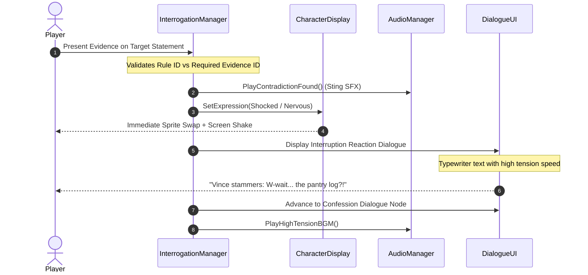

# Case Closed: 2D Detective Mystery Game
## Comprehensive Assets & Character Reactions Specification Document

**Project:** `CIT2101_2D` / *Case Closed*  
**Engine:** Unity 2D (URP)  
**Target Resolution:** 1920x1080 (16:9 Full HD)  
**File Location:** Root / `ASSETS_AND_REACTIONS_DOCUMENTATION.md`

---

## Table of Contents
1. [Project Directory & Asset Conventions](#1-project-directory--asset-conventions)
2. [Character Roster & Expression Sprite Requirements](#2-character-roster--expression-sprite-requirements)
3. [Case-by-Case Contradiction Reaction Specifications](#3-case-by-case-contradiction-reaction-specifications)
4. [Evidence Item Asset Specifications & Hotspots](#4-evidence-item-asset-specifications--hotspots)
5. [Environment & Background Art](#5-environment--background-art)
6. [UI, VFX & Visual Feedback Assets](#6-ui-vfx--visual-feedback-assets)
7. [Audio Asset Specifications (BGM & SFX)](#7-audio-asset-specifications-bgm--sfx)
8. [Master Production Asset Checklist](#8-master-production-asset-checklist)

---

## 1. Project Directory & Asset Conventions

To keep all artwork, audio, and animations cleanly organized in Unity, follow this designated directory structure:

```text
Assets/
├── Art/
│   ├── Characters/
│   │   ├── Vince_Batecan/
│   │   ├── Charl_Pascual/
│   │   ├── Paul_Camacho/
│   │   ├── Shanaia_Ortega/
│   │   ├── Shan_Jaraba/
│   │   ├── Kirby_Raymundo/
│   │   ├── Kurt_Ancheta/
│   │   └── Detectives/
│   ├── Evidence/
│   │   ├── Case01/
│   │   ├── Case02/
│   │   └── Case03/
│   ├── Backgrounds/
│   │   ├── ManorStudy/
│   │   ├── ArtGallery/
│   │   ├── CoffeeShop/
│   │   └── DeductionBoard/
│   └── UI/
│       ├── Notebook/
│       ├── Dialogue/
│       ├── DeductionPins/
│       └── Icons/
└── Audio/
    ├── BGM/
    └── SFX/
```

### Sprite Import & Texture Settings
* **Texture Type:** `Sprite (2D and UI)`
* **Sprite Mode:** `Single`
* **Pixels Per Unit (PPU):** `100` (or `200` for high-density UI/Portraits)
* **Filter Mode:** `Bilinear` (for smooth illustration) or `Point (no filter)` (if pixel art style)
* **Compression:** `RGBA 32-bit` (Lossless) or `High Quality ASTC/DXT5`

---

## 2. Character Roster & Expression Sprite Requirements

Each suspect and key witness requires a base sitting pose for the interrogation table, plus specific expressive portrait sprites triggered by the dialogue system via [CharacterProfileSO](file:///c:/Users/Janine/Documents/GitHub/CIT2101_2D/Assets/Scripts/Data/CharacterProfileSO.cs) and [CharacterDisplay](file:///c:/Users/Janine/Documents/GitHub/CIT2101_2D/Assets/Scripts/Gameplay/CharacterDisplay.cs).

### Expression Enum Reference (`CharacterExpression`)
* `Neutral` — Base calm demeanor
* `Curious` — Inquiring, head tilted
* `Nervous` — Sweating, glancing sideways, fidgeting
* `Angry` — Furrowed brow, teeth clenched, aggressive stance
* `Sad` — Downcast eyes, slumped shoulders
* `Surprised` — Wide eyes, mouth slightly agape
* `Defensive` — Crossed arms, stubborn glare, turned away
* `Shocked` — Stunned, pale face, heavy sweat drops (Contradiction hit)
* `Thinking` — Looking upward, hand on chin
* `Smug` — Confident smirk, closed eyes

---

### Character Profiles & Needed Sprites

#### 1. Vince Angelo Batecan (Case 01 — Primary Suspect)
* **Role:** Nephew of Kirby Raymundo, indebted gambler.
* **Base Personality:** Defensive / Nervous
* **Required Sprites:**
  1. `Vince_Pose_SittingDefault.png` — Slumped across interrogation table, trying to appear nonchalant.
  2. `Vince_Expr_Neutral.png` — Guarded resting face.
  3. `Vince_Expr_Defensive.png` — Frowning, arms folded, chin up: *"I never went near the study!"*
  4. `Vince_Expr_Shocked.png` — Eyes wide open, sweat dripping, jaw dropped when presented with the locked kitchen log.
  5. `Vince_Expr_Nervous.png` — Trembling, looking down, sweating profusely during confession.

---

#### 2. Kirby Raymundo (Case 01 — Victim / Aristocrat)
* **Role:** Proud, demanding manor owner whose necklace was stolen.
* **Base Personality:** Aggressive / Confident
* **Required Sprites:**
  1. `Kirby_Pose_Portrait.png` — Regal attire, cane, haughty posture.
  2. `Kirby_Expr_Angry.png` — Scowling at his ungrateful nephew.
  3. `Kirby_Expr_Smug.png` — Satisfied once the true thief is exposed.

---

#### 3. Charl Vonn Pascual (Case 02 — Primary Suspect / Guard)
* **Role:** Night security guard who took a bribe to fake a break-in.
* **Base Personality:** Calm (facade) / Defensive
* **Required Sprites:**
  1. `Charl_Pose_SittingDefault.png` — Uniformed guard with arms resting on table.
  2. `Charl_Expr_Calm.png` — Straight face, steady gaze: *"I was standing right outside the door."*
  3. `Charl_Expr_Shocked.png` — Eyes bulging, hand reaching collar when the electronic shift scanner log is pulled out.
  4. `Charl_Expr_Nervous.png` — Head in hands, slumping over during confession.

---

#### 4. Paul Gabriel Camacho (Case 02 — Secondary Suspect / Gallery Owner)
* **Role:** Dramatic, financially ruined art gallery owner who orchestrated insurance fraud.
* **Base Personality:** Secretive / Dramatic
* **Required Sprites:**
  1. `Paul_Pose_SittingDefault.png` — Elegant suit, manicured hair, dramatic gestures.
  2. `Paul_Expr_Smug.png` — Feigning grief and innocence.
  3. `Paul_Expr_Angry.png` — Snarling when the inside-broken glass and 48h insurance upgrade are proven.
  4. `Paul_Expr_Shocked.png` — Face pale, glasses askew upon exposure.

---

#### 5. Shanaia Ortega (Case 03 — Primary Suspect / Lead Developer)
* **Role:** Startup tech partner who stole the prototype drive before being terminated.
* **Base Personality:** Calm / Calculating
* **Required Sprites:**
  1. `Shanaia_Pose_SittingDefault.png` — Tech casual with signature custom jacket.
  2. `Shanaia_Expr_Calm.png` — Polished, professional smile: *"I went straight home at 5:30 PM."*
  3. `Shanaia_Expr_Shocked.png` — Cold freeze, dilated pupils when shown the back-exit CCTV still at 7:10 PM.
  4. `Shanaia_Expr_Angry.png` — Furious, leaning forward over the table, teeth bared: *"Kurt was going to take my code!"*

---

#### 6. Shan Jaraba (Case 03 — Key Informant / Cafe Manager)
* **Role:** Vigilant coffee shop manager who provided access to the security logs.
* **Base Personality:** Secretive / Observant
* **Required Sprites:**
  1. `Shan_Pose_Portrait.png` — Barista apron, notepad in pocket.
  2. `Shan_Expr_Thinking.png` — Recalling customer timeline.
  3. `Shan_Expr_Neutral.png` — Helpful witness statement.

---

#### 7. Detectives (Player Avatar & Partners)
* **Detective Kyle Gabriel Pastrana (Case 02 Lead)**: Sharp trench coat, analytical posture.
* **Detective Jane Arie Reyes (Case 03 Digital Forensics)**: Modern detective with tablet and badge.
* **Required Sprites:**
  1. `Detective_Desk_Forearms.png` (First-person perspective interrogation desk foreground).
  2. `Detective_Point_Action.png` (Used during "Hold It!" / "Objection!" contradiction animation).

---

## 3. Case-by-Case Contradiction Reaction Specifications

When the player presents the correct evidence against a challengeable statement node, the game executes a dramatic cinematic reaction sequence before transitioning to the confession node.



---

### Reaction Matrix Table

| Case | Suspect | Target Node Statement | Required Evidence | Trigger Reaction Expression | Reaction Dialogue (The "Break" Moment) | Unlocked Confession Node |
| :--- | :--- | :--- | :--- | :--- | :--- | :--- |
| **Case 01** | **Vince Angelo Batecan** | `NODE_01`: *"I never went near the study! I stayed in the kitchen from 8:30 PM until everyone started shouting!"* | `EVD_KITCHEN_LOG`<br>*(Kitchen Pantry Log)* | `CharacterExpression.Nervous` (Transits from `Defensive`) | *"Vince shifts nervously and stammers: 'Wait... the kitchen log shows it was locked by staff? I... I...'"* | `NODE_02_CONFESSION`: *"W-what?! Fine! The kitchen was locked... I needed money to clear my debts, so I took the necklace!"* |
| **Case 02** | **Charl Vonn Pascual** | `NODE_01`: *"I was standing right outside the office door when I heard the window shatter from the alley at 11:00 PM."* | `EVD_SHIFT_LOG`<br>*(Security Guard Shift Log)* | `CharacterExpression.Nervous` (Transits from `Calm`) | *"Charl loses his calm composure: 'The keycard shift log? Ah... I forgot the electronic scanners record timestamps...'"* | `NODE_02_CONFESSION`: *"Fine! The shift log doesn't lie... Mr. Paul Camacho paid me 2,000 credits to lie and stage the break-in!"* |
| **Case 03** | **Shanaia Ortega** | `NODE_01`: *"Once our 5:30 PM meeting wrapped up, I went straight home. I didn't contact Kurt or return to the cafe."* | `EVD_CCTV_STILL`<br>*(Coffee Shop CCTV Frame)* | `CharacterExpression.Shocked` & `Angry` | *"Shanaia's calm veneer snaps into fury: 'CCTV at the back exit? How did you get access to Shan Jaraba's private feeds?'"* | `NODE_02_CONFESSION`: *"What?! You found the CCTV footage? Kurt was going to fire me and take my code! I snuck back in to take what belongs to me!"* |

---

## 4. Evidence Item Asset Specifications & Hotspots

Each evidence item requires 3 sprite variants for the investigation table and inspection modal:
1. **Normal Sprite (`normalSprite`):** 256x256 icon sitting on the investigation table / notebook thumbnail.
2. **Highlighted Sprite (`highlightedSprite`):** Glow outline for mouse hover / selection.
3. **Zoomed Inspect Sprite (`zoomedSprite`):** 1024x1024 high-resolution asset used in [EvidenceInspectModal](file:///c:/Users/Janine/Documents/GitHub/CIT2101_2D/Assets/Scripts/UI/EvidenceInspectModal.cs) containing interactive clickable hotspots.

---

### Case 01: The Missing Necklace

| Evidence ID | Item Name | Category | Zoomed Sprite Visual Detail | Hotspots & Normalized Coords `(X, Y)` | Unlocked Clue |
| :--- | :--- | :--- | :--- | :--- | :--- |
| `EVD_FAMILY_PHOTO` | Family Photograph | `Photograph` | Vintage sepia manor party photo at 8:45 PM. Doorway in background has a dark figure. | `SPOT_DOORWAY_SILHOUETTE` `(0.30, 0.50)`: Silhouette matching Vince outside study. | `CLUE_VINCE_AT_DOOR` |
| `EVD_BROKEN_TEACUP` | Broken Teacup | `PhysicalClue` | Shattered porcelain teacup with dried Earl Grey stains near metal safe dial. | None (Direct inspect base clue). | `CLUE_TEACUP_AT_SAFE` |
| `EVD_KITCHEN_LOG` | Kitchen Pantry Log | `Document` | Clipboard sheet with staff signatures and red timestamp lock stamp: *8:30 PM - 9:15 PM LOCKED*. | None (Direct contradict evidence). | `CLUE_KITCHEN_LOCKED` |

---

### Case 02: The Shattered Mirror

| Evidence ID | Item Name | Category | Zoomed Sprite Visual Detail | Hotspots & Normalized Coords `(X, Y)` | Unlocked Clue |
| :--- | :--- | :--- | :--- | :--- | :--- |
| `EVD_WINDOW_PHOTO` | Window Frame Crime Photo | `Photograph` | Broken glass frame. Outside cobblestone alley has all glass shards pointing outward. | `SPOT_OUTSIDE_GLASS` `(0.50, 0.20)`: Glass shards resting on exterior pavement. | `CLUE_BROKEN_FROM_INSIDE` |
| `EVD_SHIFT_LOG` | Security Guard Shift Log | `Document` | Digital badge log printout highlighting: *11:00 PM - Charl Pascual scanned at East Gate*. | None (Direct contradict evidence). | `CLUE_GUARD_AT_EAST_GATE` |
| `EVD_INSURANCE_POLICY` | Art Insurance Policy | `Document` | Policy rider with amendment stamped 48 hours before the incident doubling coverage to $500,000. | None (Direct deduction clue). | `CLUE_DOUBLED_INSURANCE` |

---

### Case 03: The Last Call

| Evidence ID | Item Name | Category | Zoomed Sprite Visual Detail | Hotspots & Normalized Coords `(X, Y)` | Unlocked Clue |
| :--- | :--- | :--- | :--- | :--- | :--- |
| `EVD_SMARTPHONE_LOG` | Smartphone Call Log | `DigitalRecord` | Phone screen UI with missed call banner: *7:15 PM - Encrypted Line (Shanaia Ortega)*. | None (Direct deduction clue). | `CLUE_ENCRYPTED_CALL` |
| `EVD_CCTV_STILL` | Coffee Shop CCTV Frame | `Photograph` | Grainy security cam timestamped *19:10:24*. Figure in yellow/black tech jacket entering back alley. | `SPOT_DISTINCT_JACKET` `(0.40, 0.60)`: Custom embroidered logo jacket worn by Shanaia. | `CLUE_SHANAIA_RETURNED` |
| `EVD_RESIGNATION_LETTER` | Termination Notice Draft | `Document` | Folded letter on company letterhead addressed to Shanaia citing code leak violation. | None (Direct motive clue). | `CLUE_TERMINATION_MOTIVE` |

---

## 5. Environment & Background Art

All backgrounds should be painted at **1920x1080** with distinct depth layers to support camera panning and focus effects via [FixedInvestigationCamera](file:///c:/Users/Janine/Documents/GitHub/CIT2101_2D/Assets/Scripts/Gameplay/FixedInvestigationCamera.cs).

### 1. Interrogation Room (Main Gameplay Screen)
* **Foreground:** Wooden/metal interrogation desk with space for interactive evidence props.
* **Midground:** Suspect chair and silhouette lighting.
* **Background:** Subtle interrogation two-way mirror or atmospheric manor/office wall with rain against the window.
* **Lighting:** High-contrast dramatic spotlight on the suspect.

### 2. Case Scene Backgrounds
* **Case 01 (Manor Study):** Victorian oak bookshelves, heavy velvet curtains, stormy rain beating on glass, vintage wall safe.
* **Case 02 (Art Gallery Office & Alley):** Clean modern gallery wall, shattered window overlooking a damp brick alley under streetlights.
* **Case 03 (Coffee Shop Back Office):** Industrial aesthetic, espresso machines in background, server racks, back door exit with emergency light.

### 3. Deduction Pinboard Screen
* **Background:** High-res corkboard texture (`Corkboard_BG_1920.png`).
* **Visual Props:** Wooden frame, metal thumbtacks (Red, Blue, Yellow), polaroid photos, typed document cards, red thread connectors.

---

## 6. UI, VFX & Visual Feedback Assets

### UI Elements List
* **Notebook / Case File System (`CaseFileNotebookUI.cs`):**
  * `UI_Notebook_Cover.png` & `UI_Notebook_OpenSpread.png` (Leather bound case journal).
  * `UI_Tab_Suspects.png`, `UI_Tab_Evidence.png`, `UI_Tab_Deductions.png`.
  * `UI_EvidenceSlot_Card.png` & `UI_EvidenceSlot_Selected.png`.
* **Interrogation & Dialogue UI (`DialogueUI.cs`):**
  * `UI_Dialogue_Box.png` (Semi-translucent dark slate with gold/silver trim).
  * `UI_Nameplate_Badge.png` (Displays active speaker name and title).
  * `UI_PresentEvidence_Button.png` (Button to challenge testimony).
  * `UI_Objection_Banner.png` (Cinematic popup banner for contradiction moments).
* **Magnifier Inspection Modal (`EvidenceInspectModal.cs`):**
  * `UI_Modal_Backdrop.png` (Vignette blurred overlay).
  * `UI_Magnifier_Reticle.png` (Custom mouse cursor for examining hotspots).
  * `UI_Hotspot_Pulse_Glow.png` (Particle or glowing ring indicating interactive evidence points).
* **Case Conclusion Screen (`ConclusionUI.cs`):**
  * `UI_Verdict_Stamp_GUILTY.png` (Red rubber stamp effect).
  * `UI_Verdict_Stamp_SOLVED.png` (Green/Gold seal stamp).
  * `UI_Question_OptionCard.png` (Interactive button for deduction Q&A).

### Visual Effects (VFX)
* **Contradiction Flash:** Fullscreen white flash (0.15s) + camera shake (0.35s).
* **Speedlines Effect:** Anime/detective dramatic speedlines overlay for shocking testimony reveals.
* **Typewriter Caret:** Blinking line cursor during character dialogue rendering.

---

## 7. Audio Asset Specifications (BGM & SFX)

Referencing [AudioManager.cs](file:///c:/Users/Janine/Documents/GitHub/CIT2101_2D/Assets/Scripts/Managers/AudioManager.cs):

### 1. Music (BGM)
| Clip Identifier | Name in `AudioManager.cs` | Genre / Mood | Tempo / Loop Style |
| :--- | :--- | :--- | :--- |
| `BGM_INVESTIGATION` | `investigationBGM` | Noir jazz, mellow piano, brushed drums, upright bass | 75-85 BPM, smooth seamless loop |
| `BGM_INTERROGATION` | `interrogationBGM` | Rhythmic synth pulses, cello drones, steady tension | 95-105 BPM, building intensity |
| `BGM_HIGH_TENSION` | `highTensionBGM` | Fast paced strings, pounding heartbeat percussion, frantic brass | 130-140 BPM, contradiction climax |

### 2. Sound Effects (SFX)
| SFX Identifier | Field in `AudioManager.cs` | Sound Design Description |
| :--- | :--- | :--- |
| `SFX_BUTTON_CLICK` | `buttonClickSFX` | Crisp, tactile UI click / mechanical switch. |
| `SFX_PAPER_FLIP` | `paperFlipSFX` | Realistic page turn / dossier file rustle. |
| `SFX_EXAMINE_ZOOM` | `examineZoomSFX` | Smooth glass lens slide / subtle focus chime. |
| `SFX_TYPEWRITER_KEY` | `typewriterKeySFX` | Vintage mechanical typewriter clack (short 0.05s blip). |
| `SFX_CONTRADICTION` | `contradictionFoundSFX` | Heavy dramatic orchestra hit / metal clash sting (Phoenix Wright style). |
| `SFX_CLUE_DISCOVERED` | `clueDiscoveredSFX` | Bright chime / bell ring indicating a breakthrough. |
| `SFX_DEDUCTION_LINKED` | `deductionLinkedSFX` | Wooden pin thud + string snap sound on corkboard. |
| `SFX_CASE_SOLVED` | `caseSolvedSFX` | Triumphant orchestral brass fanfare with gavel strike. |
| `SFX_CASE_FAILED` | `caseFailedSFX` | Low discordant piano thud / buzzer. |

---

## 8. Master Production Asset Checklist

### 🎨 2D Character Sprites
- [ ] **Vince Angelo Batecan:** Default Sitting, Neutral, Defensive, Shocked, Nervous
- [ ] **Kirby Raymundo:** Portrait, Angry, Smug
- [ ] **Charl Vonn Pascual:** Default Sitting, Calm, Shocked, Nervous
- [ ] **Paul Gabriel Camacho:** Default Sitting, Smug, Angry, Shocked
- [ ] **Shanaia Ortega:** Default Sitting, Calm, Shocked, Angry
- [ ] **Shan Jaraba:** Portrait, Thinking, Neutral
- [ ] **Detective Avatars:** Foreground arms/desk, Action pointer sprite

### 🔍 Evidence Sprites
- [ ] **Case 01:** Family Photo (Normal, Glow, 1024x1024 Zoomed with Doorway Silhouette)
- [ ] **Case 01:** Broken Teacup (Normal, Glow, 1024x1024 Zoomed)
- [ ] **Case 01:** Kitchen Pantry Log (Normal, Glow, 1024x1024 Zoomed)
- [ ] **Case 02:** Window Frame Photo (Normal, Glow, 1024x1024 Zoomed with Exterior Glass)
- [ ] **Case 02:** Security Shift Log (Normal, Glow, 1024x1024 Zoomed)
- [ ] **Case 02:** Art Insurance Policy (Normal, Glow, 1024x1024 Zoomed)
- [ ] **Case 03:** Smartphone Call Log (Normal, Glow, 1024x1024 Zoomed)
- [ ] **Case 03:** Coffee Shop CCTV Frame (Normal, Glow, 1024x1024 Zoomed with Jacket Detail)
- [ ] **Case 03:** Termination Notice Draft (Normal, Glow, 1024x1024 Zoomed)

### 🖼️ Background Environments
- [ ] Interrogation Room Desk (1920x1080)
- [ ] Manor Study (Case 01 Scene)
- [ ] Art Gallery & Broken Window Alley (Case 02 Scene)
- [ ] Coffee Shop Back Office (Case 03 Scene)
- [ ] Deduction Corkboard Texture

### 🎛️ UI & VFX Elements
- [ ] Case File Notebook (Open book layout, tabs, cards)
- [ ] Dialogue Box & Speaker Nameplate
- [ ] Evidence Inspection Modal & Magnifier Reticle
- [ ] Deduction Board Pins & String Renderer
- [ ] Verdict Stamps (GUILTY, SOLVED)
- [ ] Contradiction Objections Banner & Speedlines VFX

### 🎵 Audio Clips
- [ ] `BGM_Investigation`
- [ ] `BGM_Interrogation`
- [ ] `BGM_HighTension`
- [ ] `SFX_ButtonClick`, `SFX_PaperFlip`, `SFX_ExamineZoom`
- [ ] `SFX_TypewriterKey`
- [ ] `SFX_ContradictionFound`
- [ ] `SFX_ClueDiscovered`
- [ ] `SFX_DeductionLinked`
- [ ] `SFX_CaseSolved` & `SFX_CaseFailed`
