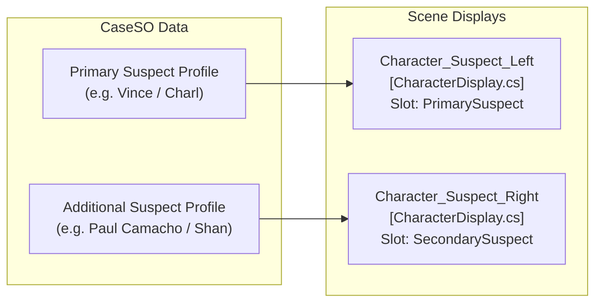
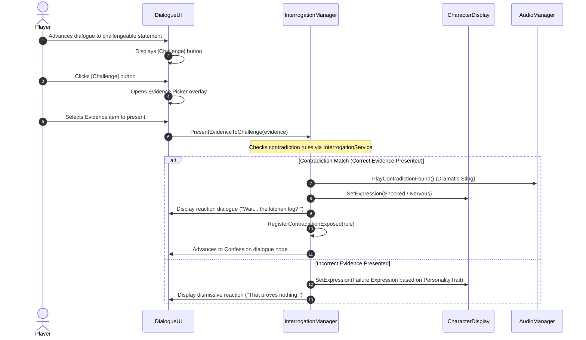

# Character & Interrogation System Guide

**Project:** `CIT2101_2D` / *Case Closed*  
**Document:** `docs/CHARACTER_AND_INTERROGATION_SYSTEM.md`

---

## 1. Dual-Character Interrogation System

In the interrogation scene sketch, two characters sit side-by-side behind the table:
* **Left Character (`Character_Suspect_Left`):** Typically the Primary Suspect under direct pressure.
* **Right Character (`Character_Suspect_Right`):** An Accomplice, Key Witness, or Secondary Suspect.



---

## 2. Character Display Component (`CharacterDisplay.cs`)

Drag [`CharacterDisplay.cs`](file:///C:/Users/Andrei/Projects/CIT2101_2D/Assets/Scripts/Gameplay/CharacterDisplay.cs) onto both character GameObjects.

### Inspector Configuration:
1. **`Character Slot`**:
   - Set to `PrimarySuspect` on `Character_Suspect_Left`.
   - Set to `SecondarySuspect` on `Character_Suspect_Right`.
2. **`Character Sprite Renderer`**: Assign the GameObject's `SpriteRenderer`.
3. **`Enable Idle Breathing`**: Checked (`true`) to apply subtle sinusoidal breathing animation so characters feel alive.
4. **`Breathing Speed`**: `2.0`
5. **`Breathing Amount`**: `0.03`

---

## 3. Character Profile ScriptableObject (`CharacterProfileSO`)

Each character's dossier and expressions are stored in a `CharacterProfileSO` asset:

```
[Header: Identity]
- Character ID: "CHAR_VINCE_BATECAN"
- Full Name: "Vince Angelo Batecan"
- Age: 25
- Occupation: "Nephew of Kirby Raymundo"
- Relationship to Victim: "Nephew"
- Personality Trait: Defensive

[Header: Dossier Details]
- Background: "Former heir disowned over gambling debts..."
- Alibi: "Claims he stayed in the kitchen from 8:30 PM..."
- Possible Motives: "Debt repayment..."
- Known Conflicts: "Argued with uncle over allowance..."

[Header: Sprites & Visual Expressions]
- Default Sitting Pose: Vince_Pose_SittingDefault.png
- Expressions List:
  • Neutral  -> Vince_Expr_Neutral.png
  • Defensive-> Vince_Expr_Defensive.png
  • Nervous  -> Vince_Expr_Nervous.png
  • Shocked  -> Vince_Expr_Shocked.png
```

---

## 4. Interrogation Dialogue & Contradiction Challenge Flow

Interrogations follow a challenge-and-break mechanic:



### Personality-Driven Failure Expressions:
When a player presents the wrong evidence, the suspect's reaction automatically matches their personality:
- **`Defensive`** $\rightarrow$ `CharacterExpression.Defensive`
- **`Nervous`** $\rightarrow$ `CharacterExpression.Nervous`
- **`Calm` / `Confident`** $\rightarrow$ `CharacterExpression.Smug`
- **`Aggressive`** $\rightarrow$ `CharacterExpression.Angry`
- **`Secretive`** $\rightarrow$ `CharacterExpression.Thinking`
