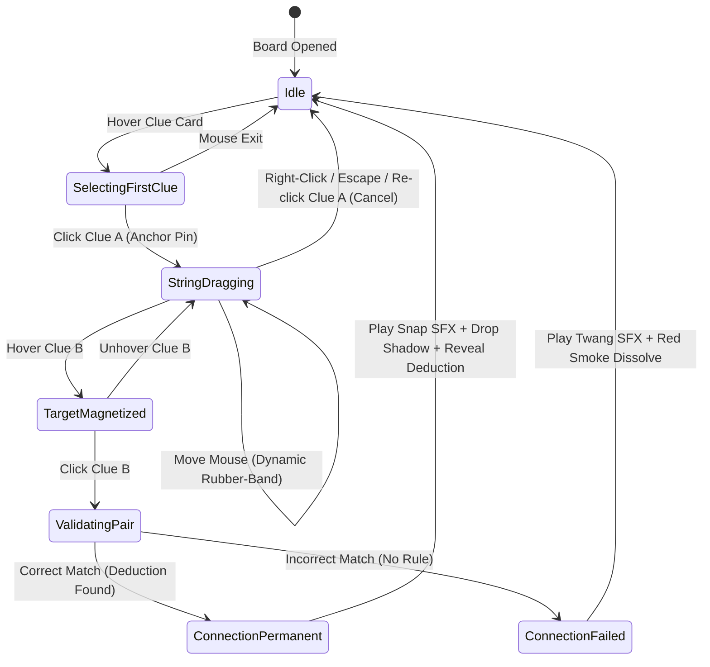

# Mind Palace "Red String" Corkboard Connection System
## Production-Grade One-Shot Implementation Plan

**Document:** `MIND_PALACE_RED_STRING_SYSTEM_PLAN.md`  
**Project:** `CIT2101_2D` (*Case Closed* - Detective Investigation & Interrogation Game)  
**Engine & Tech:** Unity 6 (`6000.3.20f1`), Universal Render Pipeline (URP 17.3), UGUI 2.0, Input System 1.19  
**Location:** [`docs/MIND_PALACE_RED_STRING_SYSTEM_PLAN.md`](file:///home/vbatecan/Projects/game_dev/my2D/CIT2101_2D/docs/MIND_PALACE_RED_STRING_SYSTEM_PLAN.md)

---

## 1. Executive Summary & High-Concept Vision

The **Mind Palace "Red String" Connection System** transforms the Deduction Board ([`Panel_DeductionBoard.prefab`](file:///home/vbatecan/Projects/game_dev/my2D/CIT2101_2D/Assets/Prefabs/UI/Panels/Panel_DeductionBoard.prefab)) from a standard button-clicking UI into an authentic, tactile **detective conspiracy corkboard** (inspired by *Ace Attorney*, *Alan Wake 2: Mind Place*, and *Sherlock Holmes: Crimes & Punishments*).

### Player Experience Journey:
1. **Interactive Pinning**: Clue cards are pinned to a textured corkboard background with wooden/brass pushpins and subtle rotation variance ($-2.5^\circ$ to $+2.5^\circ$).
2. **Dynamic Rubber-Band String**: Clicking Clue A anchors a taut red woolen yarn to its pushpin. As the detective moves their mouse/pointer across the board, an elastic red string dynamically stretches and sags toward the cursor in real time.
3. **Hover Preview & Magnetism**: Hovering over another clue pin magnetically pulls the yarn to the target pushpin and highlights it in amber gold.
4. **Validation & Connection Snap**:
   - **Correct Deduction**: The player clicks the matching clue. A tactile pushpin press sound and woolen string snap play simultaneously. The red yarn permanently bolts between the two cards with natural catenary sag and a subtle drop shadow onto the corkboard. A golden deduction synthesis banner pops up, unlocking the synthesized clue in the case notebook.
   - **Incorrect Deduction**: An elastic twang audio cue plays, the rubber-band string snaps back and dissolves with a red puff, and a brief "No logical connection..." banner fades away.
5. **Persistent Web of Evidence**: When closing and reopening the Deduction Board, all existing connections are instantly restored, weaving an evolving spiderweb of deductions as the case progresses.

---

## 2. Technical Architecture & Component Separation

Adhering strictly to **Separation of Concerns (SoC)** and the **Zero-GC Runtime Standard** in [`AGENTS.md`](file:///home/vbatecan/Projects/game_dev/my2D/CIT2101_2D/AGENTS.md) and [`GEMINI.md`](file:///home/vbatecan/Projects/game_dev/my2D/CIT2101_2D/GEMINI.md):

```
┌─────────────────────────────────────────────────────────────┐
│                       DATA LAYER                            │
│  ClueConnectionSO.cs, CaseSO.cs, CluePinLayoutSO.cs          │
└──────────────────────────────┬──────────────────────────────┘
                               │
┌──────────────────────────────▼──────────────────────────────┐
│                    DOMAIN / MATH SERVICE                     │
│  DeductionService.cs (Connection matching)                  │
│  CatenaryCurveService.cs (Pure C# Bezier/Catenary Math)      │
│  • Zero MonoBehaviour dependencies  • 100% Unit Testable    │
└──────────────────────────────┬──────────────────────────────┘
                               │
┌──────────────────────────────▼──────────────────────────────┐
│                 MANAGER & STATE CONTROLLER                  │
│  DeductionBoardController.cs (Pairing, selection, events)    │
└──────────────────────────────┬──────────────────────────────┘
                               │
┌──────────────────────────────▼──────────────────────────────┐
│                      VIEW & RENDERING                        │
│  UIRedStringCanvas.cs (Custom UGUI MaskableGraphic)          │
│  DeductionBoardUI.cs (Coordinates view, banner, audio)       │
│  UI_ClueCard.cs (Pushpin anchor point, hover feedback)       │
└─────────────────────────────────────────────────────────────┘
```

---

## 3. Detailed Technical Specifications

### A. Graphical Rendering: Custom UGUI `UIRedStringCanvas`
Instead of heavyweight world-space `LineRenderer` components (which suffer from canvas depth sorting issues and resolution mismatch), the red strings are rendered natively inside the UGUI Canvas using a custom **`UIRedStringCanvas : MaskableGraphic`**.

#### Why `MaskableGraphic`?
- **Single Draw Call**: All connection lines (active and completed) are batched together into one canvas mesh element.
- **Zero GC Allocations**: Uses pre-allocated vertex and index buffers with `VertexHelper`.
- **Canvas Scaler Compatibility**: Automatically scales with dynamic resolutions (1920×1080 reference resolution, pixel-perfect alignment).
- **Curved Ribbon Geometry**: Evaluates quadratic Bezier curves with natural downward gravitational sag and creates camera-facing quads with drop shadow vertices.

#### Mathematical Model: Quadratic Bezier Curve with Gravitational Sag
For endpoints $P_0$ (Clue A Pin) and $P_2$ (Clue B Pin):
1. **Control Point $P_1$**:
   $$\text{midpoint} = \frac{P_0 + P_2}{2}$$
   $$\text{distance} = \|P_2 - P_0\|$$
   $$\text{sagAmount} = \min(\text{distance} \times 0.12,\; 45.0\text{px})$$
   $$P_1 = \text{midpoint} + (0, -\text{sagAmount})$$
2. **Curve Evaluation** ($t \in [0, 1]$ over $N=12$ segments):
   $$B(t) = (1-t)^2 P_0 + 2(1-t)t P_1 + t^2 P_2$$
3. **Ribbon Mesh Construction**:
   At each sample $t$, compute tangent $\vec{T} = \frac{dB}{dt}$ and normal $\vec{N} = (-\vec{T}_y, \vec{T}_x) / \|\vec{T}\|$.
   Offset vertices by $\pm \frac{\text{lineWidth}}{2} \vec{N}$ to form a continuous 2D quad strip.
4. **Drop Shadow Layer**:
   Generate an identical strip offset by $(1.5\text{px}, -2.5\text{px})$ with black color and $\alpha = 0.45$ directly underneath the red string within the same mesh.

---

### B. Pin Positioning & Anchor Model
Every clue card instantiated from [`UI_ClueCard.prefab`](file:///home/vbatecan/Projects/game_dev/my2D/CIT2101_2D/Assets/Prefabs/UI/Elements/UI_ClueCard.prefab) will expose:
- A `pinAnchor` child `RectTransform` positioned at the top-center of the card (offset: `(0, 24)`).
- A child pushpin graphic (`Image`) with realistic brass/wooden pin artwork and cast shadow.
- Subtle procedural tilt angle applied on spawn:
  $$\text{tilt} = \text{Random.Range}(-2.5^\circ, +2.5^\circ)$$

---

### C. Connection State Machine



---

## 4. File-by-File Implementation Plan

### 1. Pure C# Domain Service: `Assets/Scripts/Services/CatenaryCurveService.cs`
**Responsibility**: Zero-allocation math service for generating Bezier curve points, normals, and tangent vectors.
- `EvaluateQuadraticBezier(Vector2 p0, Vector2 p1, Vector2 p2, float t)`
- `GenerateCurvePointsNonAlloc(Vector2 start, Vector2 end, float sagIntensity, Vector2[] buffer, int count)`
- `ComputeNormalNonAlloc(Vector2 tangent, ref Vector2 normalOut)`

### 2. Rendering Component: `Assets/Scripts/UI/UIRedStringCanvas.cs`
**Responsibility**: `MaskableGraphic` rendering all completed strings and the active dragging rubber-band string.
- Serialized Properties:
  - `Color stringColor` = `#D62828` (Crimson Yarn)
  - `Color shadowColor` = `#00000073` (Drop Shadow)
  - `float lineWidth` = `4.0f`
  - `float shadowOffset` = `3.0f`
  - `int curveSegments` = `12`
  - `float sagFactor` = `0.12f`
  - `Sprite yarnTexture` (Optional textured wool repeating pattern)
- Core Methods:
  - `AddPermanentConnection(string clueA, string clueB, Vector2 startPoint, Vector2 endPoint)`
  - `SetActiveRubberBand(Vector2 startPoint, Vector2 currentMousePos)`
  - `ClearActiveRubberBand()`
  - `ClearAllConnections()`
  - `RebuildMesh(VertexHelper vh)` overrides `OnPopulateMesh`

### 3. Controller Updates: `Assets/Scripts/Managers/DeductionBoardController.cs`
**Responsibility**: Enhance clue pairing logic and add fine-grained connection lifecycle events.
- New Events:
  - `event Action<string, Vector2> OnConnectionDraftStarted` (ClueID, PinCanvasPosition)
  - `event Action OnConnectionDraftCancelled`
  - `event Action<string, string, ClueConnectionSO> OnConnectionSuccessfullyFormed`
  - `event Action<string, string> OnConnectionAttemptFailed`
- Methods:
  - `StartDraft(string clueId, Vector2 pinPos)`
  - `CancelDraft()`
  - `CommitPair(string clueIdA, string clueIdB)`

### 4. UI View Updates: `Assets/Scripts/UI/DeductionBoardUI.cs`
**Responsibility**: Connect the `UIRedStringCanvas` to the user interface, handle mouse motion, trigger animations, and play sound effects.
- New Serialized Fields:
  - `[Header("Red String Mind Palace Visuals")]`
  - `public UIRedStringCanvas redStringCanvas;`
  - `public Transform stringLayerContainer;`
  - `[Header("Pin Audio Feedback")]`
  - `public AudioClip pinPushSFX;`
  - `public AudioClip stringSnapSFX;`
  - `public AudioClip stringTwangSFX;`
- In `Update()`:
  - If drafting connection: convert `Input.mousePosition` to local canvas rect coordinates and pass to `redStringCanvas.SetActiveRubberBand(start, current)`.
  - Right-click / Escape cancels active string.
- In `RefreshBoard()`:
  - Query all completed connections from `CaseManager.Instance.activeCase` and `unlockedCluesText`.
  - Locate instantiated clue cards for each connected pair and call `redStringCanvas.AddPermanentConnection(...)`.

### 5. Prefab & Element Updates:
- **`UI_ClueCard.prefab`**:
  - Add child `Pushpin` (`RectTransform` `(0, 24)`, size `20x20`) with pin sprite and shadow.
  - Expose `public RectTransform PinAnchor` on [`UI_ClueCard.cs`](file:///home/vbatecan/Projects/game_dev/my2D/CIT2101_2D/Assets/Prefabs/UI/Elements/UI_ClueCard.prefab).
- **`Panel_DeductionBoard.prefab`**:
  - Insert `RedString_Canvas` GameObject under `Panel_DeductionBoard` between the corkboard background and the clue cards container (so cards sit on top of pins and strings).
  - Attach `UIRedStringCanvas` component.
  - Wire `redStringCanvas` reference in `DeductionBoardUI`.

---

## 5. Audio & Visual Assets Plan

| Asset Type | File Name / Path | Specification |
| :--- | :--- | :--- |
| **Pushpin Sprite** | `Assets/Assets/UI/Pushpin_Wood.png` | 64×64 PNG with metallic brass needle and circular wooden head with drop shadow. |
| **Yarn Texture** | `Assets/Assets/UI/Yarn_Red_Tile.png` | 32×8 seamless repeating braided fiber pattern. |
| **Pushpin Push SFX** | `Assets/Audio/PIN PUSH SFX.mp3` | Tactile, low-frequency wooden desk tack press (50ms). |
| **String Snap SFX** | `Assets/Audio/STRING SNAP SFX.mp3` | Crisp taut woolen string pluck/twang (120ms). |
| **String Dissolve SFX**| `Assets/Audio/STRING DISSOLVE SFX.mp3`| Soft rubber elastic twang indicating non-matching clues (180ms). |

---

## 6. Edge Cases & Robustness Matrix

| Scenario / Edge Case | Expected Behavior & Solution |
| :--- | :--- |
| **Fast Double Clicks** | Clicking Clue A twice in rapid succession cancels the string cleanly (`CancelDraft()`) rather than forming a self-loop. |
| **Window Resizing / Aspect Ratio Shift** | Pins store local anchored positions relative to `cluesContainer`. `UIRedStringCanvas` calculates positions in Canvas local space, maintaining exact alignment at any aspect ratio (16:9, 16:10, 21:9). |
| **Closing Deduction Board Mid-Draft** | `OnDisable()` in `DeductionBoardUI` automatically aborts active draft and clears the rubber-band string to prevent ghost lines on next open. |
| **Already Connected Clues** | If player selects Clue A and Clue B that are already linked, plays a gentle reminder sound and shows "Already Connected" without duplicating strings. |
| **Scrolling Corkboard** | If clue cards reside inside a scroll rect, `UIRedStringCanvas` is parented to the scrolling content container so strings move in 1:1 sync with cards without lagging. |

---

## 7. Comprehensive Automated Test Strategy

Create [`Assets/Scripts/Editor/DeductionRedStringTests.cs`](file:///home/vbatecan/Projects/game_dev/my2D/CIT2101_2D/Assets/Scripts/Editor/) covering:

1. **Math & Geometry Unit Tests**:
   - `CatenaryCurveService_EvaluatesEndpointsAccurately`: Ensures $B(0) == P_0$ and $B(1) == P_2$.
   - `CatenaryCurveService_CalculatesDownwardSag`: Validates that midpoint has lower $Y$ coordinate than both endpoints.
   - `CatenaryCurveService_HandlesZeroDistanceGracefully`: Zero-distance endpoints do not cause `NaN` or divide-by-zero errors.
2. **State Machine & Controller Tests**:
   - `DeductionBoardController_DraftCycle_FlowsCorrectly`: Selecting Clue A sets drafting state; selecting matching Clue B triggers `OnConnectionSuccessfullyFormed`.
   - `DeductionBoardController_SelectingSameClue_CancelsDraft`: Deselection behavior.
   - `DeductionBoardController_InvalidPair_TriggersFailureEvent`: Mismatched clues fire `OnConnectionAttemptFailed`.
3. **Canvas & Mesh Generation Tests**:
   - `UIRedStringCanvas_GeneratesValidQuads`: Verifies vertex count equals $(\text{segments} + 1) \times 2 \times 2$ (including shadow layer).
   - `UIRedStringCanvas_Persistence_ReconstructsCompletedStrings`: Verifies that previously solved connections are populated on board load.

---

## 8. Implementation Phases & Milestones

### Phase 1: Mathematical Services & Pure C# Logic
- Create [`Assets/Scripts/Services/CatenaryCurveService.cs`](file:///home/vbatecan/Projects/game_dev/my2D/CIT2101_2D/Assets/Scripts/Services/).
- Create [`Assets/Scripts/Editor/DeductionRedStringTests.cs`](file:///home/vbatecan/Projects/game_dev/my2D/CIT2101_2D/Assets/Scripts/Editor/) with 100% unit test coverage for Bezier geometry and sag calculations.

### Phase 2: Procedural UGUI Canvas Graphic
- Create [`Assets/Scripts/UI/UIRedStringCanvas.cs`](file:///home/vbatecan/Projects/game_dev/my2D/CIT2101_2D/Assets/Scripts/UI/).
- Implement `OnPopulateMesh` with vertex-colored ribbon generation, anti-aliasing edge bevels, and drop shadow offsets.

### Phase 3: Controller Events & Drafting State Machine
- Expand [`DeductionBoardController.cs`](file:///home/vbatecan/Projects/game_dev/my2D/CIT2101_2D/Assets/Scripts/Managers/DeductionBoardController.cs) with drafting coordinates, cancellation, and connection callbacks.
- Update [`DeductionService.cs`](file:///home/vbatecan/Projects/game_dev/my2D/CIT2101_2D/Assets/Scripts/Services/DeductionService.cs) if custom connection weights or multi-point synthesis rules are required.

### Phase 4: Prefab Enhancement & UI Integration
- Update [`UI_ClueCard.prefab`](file:///home/vbatecan/Projects/game_dev/my2D/CIT2101_2D/Assets/Prefabs/UI/Elements/UI_ClueCard.prefab) with pushpin graphic and anchor transform.
- Update [`Panel_DeductionBoard.prefab`](file:///home/vbatecan/Projects/game_dev/my2D/CIT2101_2D/Assets/Prefabs/UI/Panels/Panel_DeductionBoard.prefab) to include `RedString_Canvas` layer.
- Wire input tracking in [`DeductionBoardUI.cs`](file:///home/vbatecan/Projects/game_dev/my2D/CIT2101_2D/Assets/Scripts/UI/DeductionBoardUI.cs) for mouse tracking, snap animations, and audio playback.

### Phase 5: Verification & Full Regression Testing
- Trigger `refresh_unity(compile=true, wait_for_ready=true)` and inspect console for 0 errors.
- Execute full NUnit EditMode test runner: ensure all 90 existing tests + new red string tests pass with **100% Pass Rate**.
- Update documentation in [`docs/`](file:///home/vbatecan/Projects/game_dev/my2D/CIT2101_2D/docs/).
