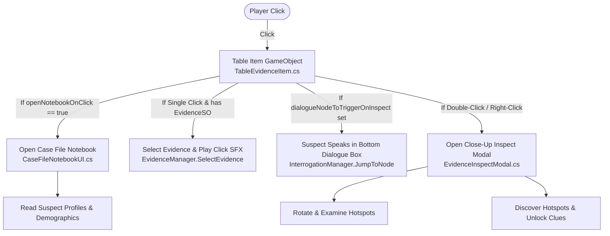

# Table Items & Interactions Guide

**Project:** `CIT2101_2D` / *Case Closed*  
**Document:** `docs/TABLE_ITEMS_AND_INTERACTIONS_GUIDE.md`

---

## 1. Overview of Table Desk System

In the investigation scene, the detective sits across a table from the suspects. On this desk are interactive game objects:
1. **The Case File Notebook (Open Book):** When clicked, opens the detective dossier containing photos, personal information, demographic profiles, alibis, motives, and discovered clues.
2. **Evidence Items (Photos, Weapons, Documents, Personal Effects):** When clicked, allows the player to inspect close-up, discover hidden hotspots, and trigger suspect dialogue explanations in the bottom dialogue box.

---

## 2. Setting Up the Open Case Book Item

In your sketch, an open book sits in the center of the table.

### Inspector Setup for the Book:
1. Create a 2D GameObject named `Item_CaseBook`.
2. Add a `SpriteRenderer` and assign an open notebook sprite.
3. Add a `BoxCollider2D` (sized to the book sprite).
4. Drag and drop [`TableEvidenceItem.cs`](file:///C:/Users/Andrei/Projects/CIT2101_2D/Assets/Scripts/Gameplay/TableEvidenceItem.cs) onto the GameObject.
5. In the Inspector:
   - **`Evidence Data`**: Leave blank (null).
   - **`Open Notebook On Click`**: **Checked (`true`)**.

### What Happens When Clicked:
- It calls `UIManager.Instance.ShowPanel(UIPanelType.CaseFileNotebook)`.
- [`CaseFileNotebookUI.cs`](file:///C:/Users/Andrei/Projects/CIT2101_2D/Assets/Scripts/UI/CaseFileNotebookUI.cs) opens and displays:
  - **Summary Tab:** Case overview, location, victim info, incident description, and objectives.
  - **Suspects Tab:** Full dossier profiles of all suspects sitting at the table (Full Name, Age, Occupation, Relationship to Victim, Personality Trait, Alibi, Motive, Known Conflicts).
  - **Evidence Tab:** All discovered evidence items and examination notes.
  - **Clues Tab:** All unlocked clues and synthesized deduction notes.

---

## 3. Setting Up Evidence Items with Dialogue Explanations

When physical clues on the table (like the envelope/photo on the left, the knife in the center, or the cup on the right) are clicked, you can configure them to either zoom in for inspection or make the suspect in front start explaining the item.

### Inspector Setup for an Evidence Item:
1. Create a 2D GameObject (e.g. `Item_Photo_Evidence`).
2. Add `SpriteRenderer` and `BoxCollider2D`.
3. Drag and drop [`TableEvidenceItem.cs`](file:///C:/Users/Andrei/Projects/CIT2101_2D/Assets/Scripts/Gameplay/TableEvidenceItem.cs) onto it.
4. In Inspector:
   - **`Evidence Data`**: Assign the `EvidenceSO` asset (e.g. `EVD_FAMILY_PHOTO`).
   - **`Open Notebook On Click`**: Unchecked (`false`).
   - **`Dialogue Node To Trigger On Inspect`**: *(Optional)* Set to a dialogue node ID (e.g. `NODE_01_EXPLAIN_PHOTO`).

### Interaction Behaviors:
| Action | Input | Behavior |
| :--- | :--- | :--- |
| **Select & Explain** | Single Left Click | Selects item in [`EvidenceManager`](file:///C:/Users/Andrei/Projects/CIT2101_2D/Assets/Scripts/Managers/EvidenceManager.cs), plays button SFX, and triggers suspect explanation dialogue in the bottom dialogue box. |
| **Close-Up Zoom** | Double-Click or Right-Click | Opens [`EvidenceInspectModal`](file:///C:/Users/Andrei/Projects/CIT2101_2D/Assets/Scripts/UI/EvidenceInspectModal.cs) where players can rotate the sprite $\pm 90^\circ$ and click interactive hotspots. |
| **Hover Feedback** | Mouse Cursor Hover | Applies subtle yellow hover tint and activates highlight glow GameObject. |

---

## 4. Configuring Inspectable Hotspots on Evidence

To allow players to discover hidden clues on zoomed evidence items (such as the silhouette on the photo or glass shards on the window frame):

1. Select the `EvidenceSO` ScriptableObject in the Project view.
2. In the `Hotspots` list, add a new element:
   - **`Hotspot Id`**: e.g. `SPOT_DOORWAY_SILHOUETTE`
   - **`Hotspot Title`**: e.g. `Study Doorway Silhouette`
   - **`Normalized Position`**: Normalized $(X, Y)$ coordinate between $0.0$ and $1.0$ (e.g. `(0.3, 0.5)` for center-left).
   - **`Observation Text`**: e.g. *"Silhouette matching Vince standing right outside study room at 8:45 PM."*
   - **`Clue Unlocked Id`**: e.g. `CLUE_VINCE_AT_DOOR`
3. When the player opens the Inspect Modal and clicks the yellow hotspot marker, it automatically turns green, unlocks the clue in `CaseManager`, and logs discovery!
