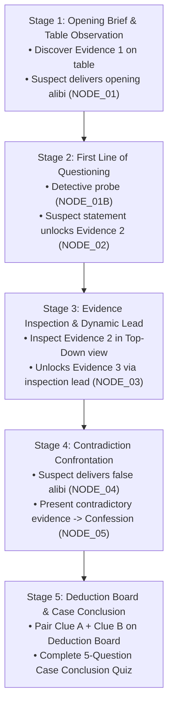

# Case Closed — Master Story & Level Design Bible

**Game Title:** *Case Closed* (CIT2101_2D)  
**Genre:** 2D Detective Mystery, Interrogation & Forensic Deduction  
**Engine:** Unity 6 (`6000.3.20f1`) | URP 2D  
**Target Playtime:** 3 to 5 Minutes per Level | Episodic Investigation Flow  

---

## 1. Narrative Vision & Tone

*Case Closed* blends the atmospheric tension of neo-noir investigative thrillers with the deductive satisfaction of courtroom drama games (such as *Ace Attorney* and *L.A. Noire*). Players assume the role of an elite detective seated across from suspects in an intimate, pressure-cooker interrogation chamber.

### Core Pillars:
1. **Physical Evidence as Truth Anchor:** Suspects lie; material evidence does not. Every contradiction is grounded in forensic reality (timestamps, broken glass physics, camera stills, digital logs).
2. **Dynamic Pressure & The Break:** Interrogations progress through tension tiers. Suspects maintain calm or defensive facades until confronted with indisputable physical contradictions, causing dramatic emotional breakdowns (sprite state transitions, vocal stings, camera shakes).
3. **Desk-Centric Tactile Gameplay:** The desk is the player's command deck. The player examines physical artifacts in Table POV, lifts them for 360-degree forensic inspection in Top POV, and connects clues on a corkboard deduction map before delivering the final indictment.

---

## 2. Episodic Level Overview

```
┌───────────────────────────────────────────────────────────────────────────────────────┐
│                               CASE CLOSED: EPISODIC ARC                               │
├─────────┬───────────────────────────────┬──────────────────────────┬──────────────────┤
│ Level   │ Case Title                    │ Primary Suspect          │ Crime Archetype  │
├─────────┼───────────────────────────────┼──────────────────────────┼──────────────────┤
│ Level 1 │ The Missing Necklace          │ Vince Angelo Batecan     │ Domestic Theft   │
│         │ (Manor Study, Stormy Night)   │ (Victim's Nephew)        │ (Gambling Debt)  │
├─────────┼───────────────────────────────┼──────────────────────────┼──────────────────┤
│ Level 2 │ The Shattered Mirror          │ Charl Vonn Pascual       │ Staged Burglary  │
│         │ (Art Gallery, 11:00 PM)       │ (Night Security Guard)   │ (Insurance Fraud)│
├─────────┼───────────────────────────────┼──────────────────────────┼──────────────────┤
│ Level 3 │ The Last Call                 │ Shanaia Ortega           │ Corporate Esp.   │
│         │ (Coffee Shop, After Hours)    │ (Lead Developer)         │ (IP Theft/Venge) │
└─────────┴───────────────────────────────┴──────────────────────────┴──────────────────┘
```

---

## 3. Case Structure & Gameplay Progression

Each case adheres to a structured, highly repeatable 5-stage investigative loop:



---

## 4. Documentation Index

The narrative documentation in this directory is divided into specialized modules:

1. **[`LEVEL_01_THE_MISSING_NECKLACE.md`](file:///home/vbatecan/Projects/game_dev/my2D/CIT2101_2D/docs/story/levels/LEVEL_01_THE_MISSING_NECKLACE.md)**  
   Complete story script, character motivations, forensic analysis, branching dialogue trees, and conclusion quiz for Level 1.
2. **[`LEVEL_02_THE_SHATTERED_MIRROR.md`](file:///home/vbatecan/Projects/game_dev/my2D/CIT2101_2D/docs/story/levels/LEVEL_02_THE_SHATTERED_MIRROR.md)**  
   Complete story script, guard-owner collusion dynamics, glass physics contradiction, and conclusion quiz for Level 2.
3. **[`LEVEL_03_THE_LAST_CALL.md`](file:///home/vbatecan/Projects/game_dev/my2D/CIT2101_2D/docs/story/levels/LEVEL_03_THE_LAST_CALL.md)**  
   Complete story script, tech-startup corporate espionage, CCTV still breakdown, and conclusion quiz for Level 3.
4. **[`CHARACTERS_AND_CAST.md`](file:///home/vbatecan/Projects/game_dev/my2D/CIT2101_2D/docs/story/levels/CHARACTERS_AND_CAST.md)**  
   Comprehensive dramatis personae: psychological profiles, visual asset mappings, voice direction, and relationships for all 8 cast members and 2 playable investigators.
